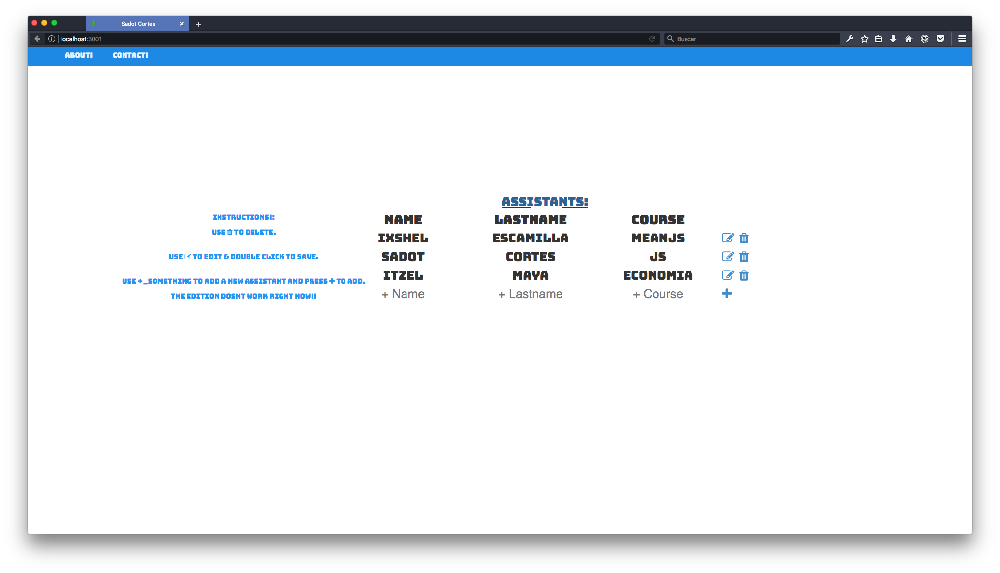

# Sadot Maximiliano Cortés Márquez

## Assistants and Professor view.

Make sure use npm install to install all the dependecies.
* What's new?
  > serve-favicon:
    >> to insert a favicon using Express, I insert MongoDB favicon, why? cuz it's cool!. 

DEMO: 

<sadotcortes@scoorm.me>

[Facebook](https://www.facebook.com/SadotCorts)

[GitHub](https://github.com/SadotCorts)